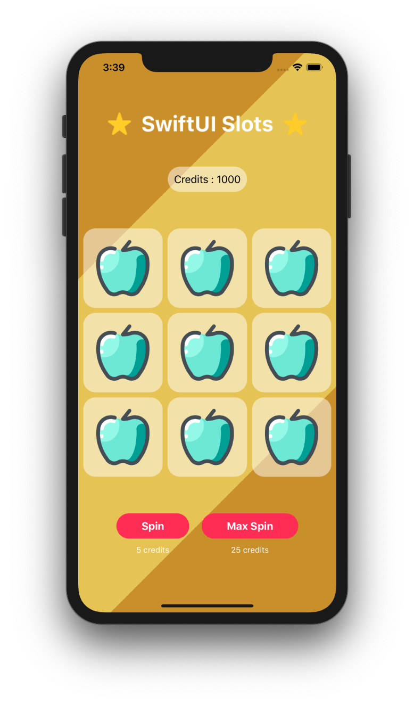

# Slots

  

## Overview

Slots is an iOS app built using Apple's latest framework SwiftUI. Hit the Spin button and earn credits. The app incorporates:

- SwiftUI
- Bindable Objects
- Images and Text
- Stacks

## Getting Started

> This app is not available on the App Store.

### Prerequisites

- A Mac running macOS
- Xcode

### Installation

1. Clone or download the project to your local machine
2. Open the project in Xcode
3. Run the simulator
